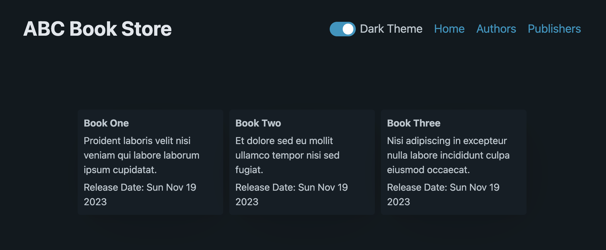
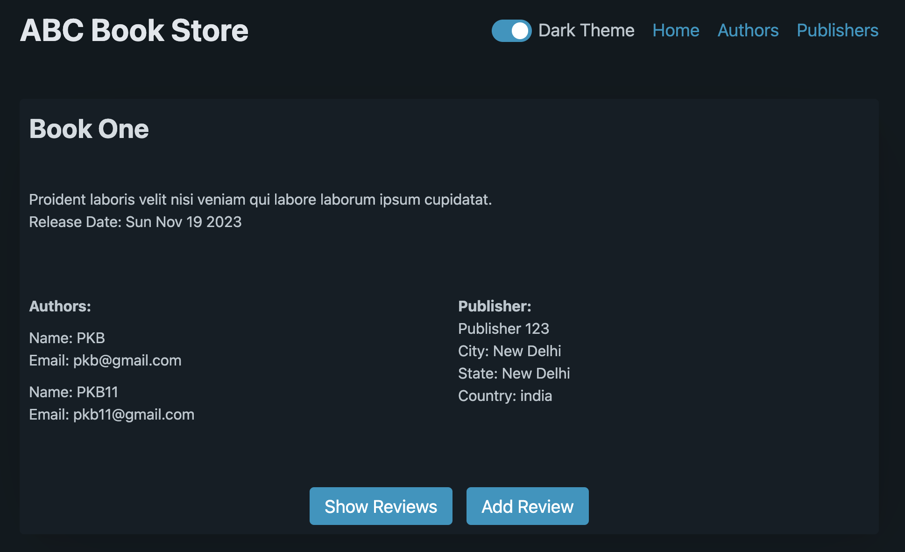
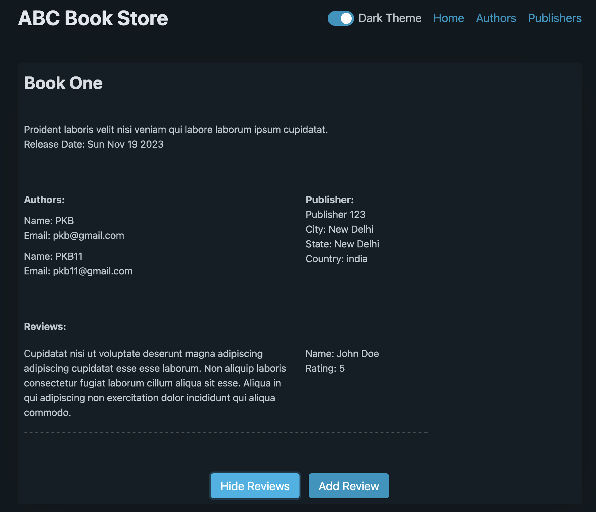
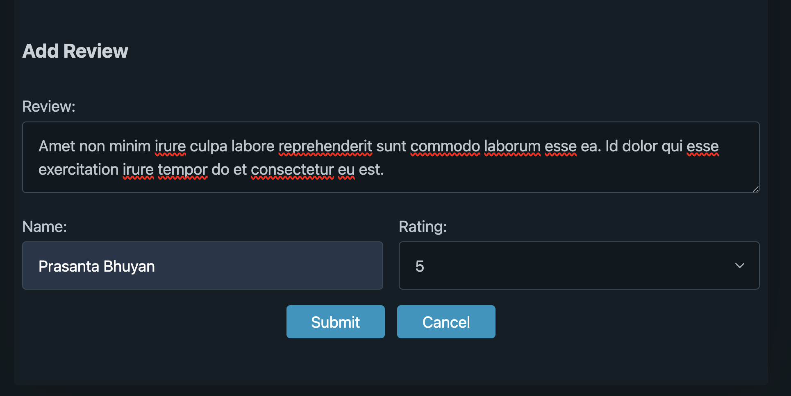
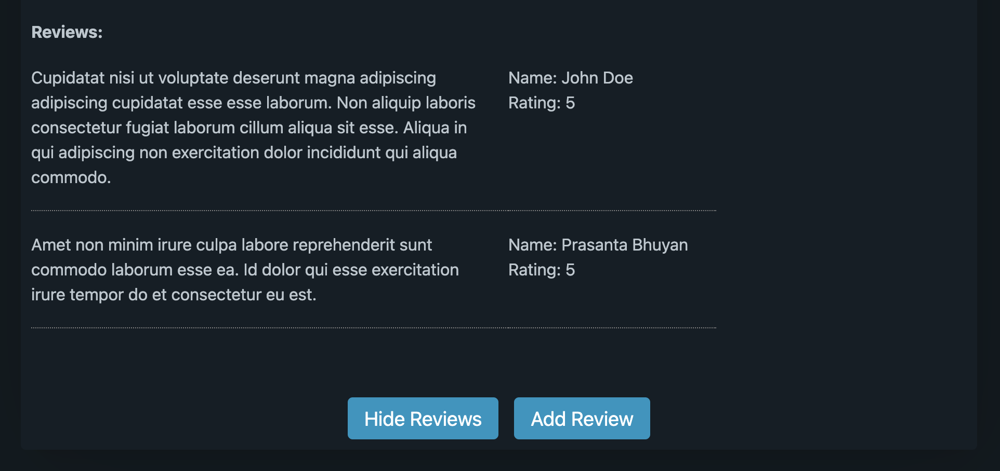

### GraphQL with SpringBOOT and React JS

This is a simple book store application to highlight the usage and potential advatages
of GraphQL over RESTApi. Let's go over page by page to see how different graph queries and mutations are 
executed.

### Book Store Home[Book List]


#### Graph Query
We are only requesting the basic information about a book and not requesting addtional 
information which would result in expensive join queries.
```agsl
query GetAllBooks {
    allBooks {
      bid
      title
      description
      releaseDate
    }
  }
```

### Book Details


#### Graph Query
For the details page we are requesting additional details like authors and publisher. But we are not requesting 
reviews yet.
```agsl
query GetBookById($bookId: String) {
    getBook(bookId: $bookId) {
      bid
      title
      description
      releaseDate
      publisher {
        pid
        name
        city
        state
        country
      }
      authors {
        aid
        name
        email
      }
    }
  }
```

### Book Details with Review


#### Graph Query
When user clicks on show reviews we request just the reviews for this
book and not authors or publisher as we have those information already.
```agsl
query GetBookById($bookId: String) {
    getBook(bookId: $bookId) {
      bid
      reviews {
        rid
        reviewerName
        review
        rating
      }
    }
  }
```

### Add Revew



#### Graph Mutation
We are invoking graph mutation to store the review and then calling the graph query above to 
refresh the reviews list. 
```agsl
mutation AddReview(
    $bid: ID!
    $reviewerName: String!
    $review: String!
    $rating: Int!
  ) {
    addReview(
      bid: $bid
      reviewInput: {
        reviewerName: $reviewerName
        review: $review
        rating: $rating
      }
    ) {
      reviews {
        review
        reviewerName
        rating
      }
    }
  }
```

### Tech Stack[Backend]
- SpringBoot
- SpringBoot Starter Web
- SpringBoot Starter GraphQL
- Postgres

### Tech Stack[Client]
- ReactJS
- Apollo GraphQL Client
- Pico CSS

### Tech Stack[Build and Test]
- Maven
- Test Container Postgres
- Frontend Maven Plugin[to build node modules]
- Docker Compose


### Getting Started
Step 1:
```agsl
mvn clean package
```

Step 2:
```agsl
docker compose up -d
```

Application URL: http://localhost:8080

GraphQL Console URL: http://localhost:8080/graphiql


